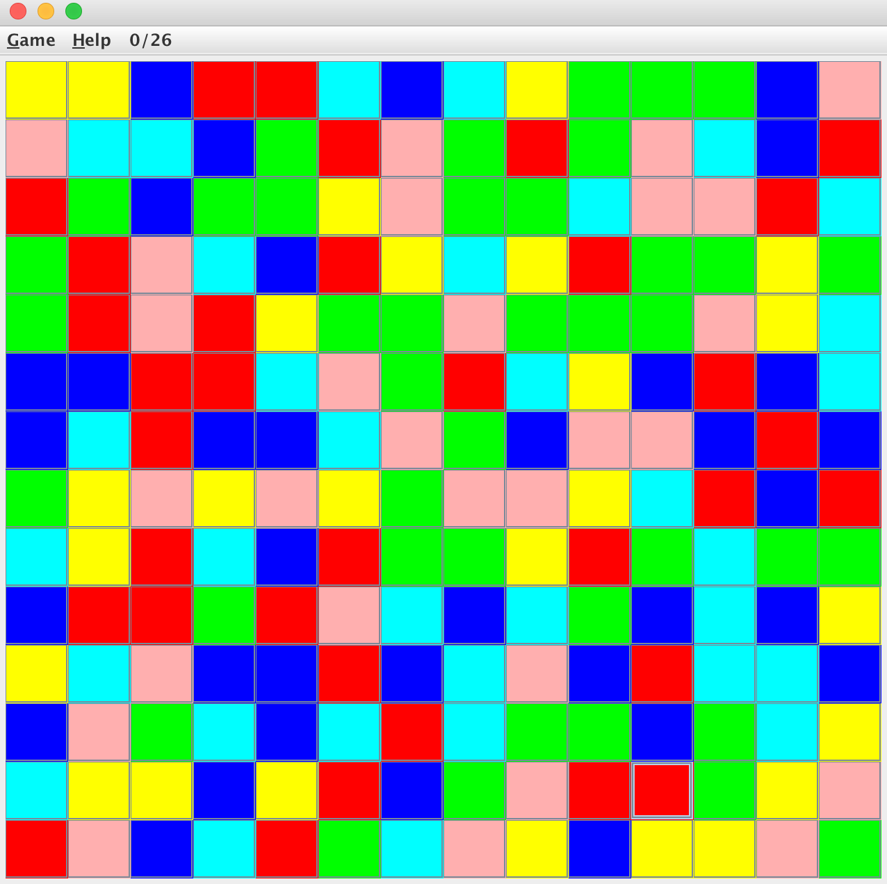
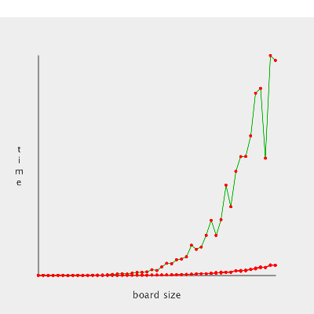

## Flood it!



##### Compilation

```
cd src/
javac *
```

##### Run
```
java Driver
```


##### Implementation


The function f(n) = n*lgn fits the best to the graph. "flood" is the first and the most basic implementation of the FloodFunction. The code in "flood" is a for loop with four parts: up, down,left, and right. In the for loop, the current is the tile that is being selected. Each adjacent side of the current tile, called the neighbor tiles, have to satisfy three conditions to be added to the "flooded_list". The first condition is that the neighbor tile can't be in "flooded_list" already because here. The second condition is that the neighbor tile has to be the same color as the top-left corner tile. The last condition is that the neighbor tile has to be "inbound" which means that it cannot be outside of the board. If all three conditions are met, the neighbor tile of the current tile is added to the "flooded_list". If one or more of the conditions are not satisfied, the neighbor tile will not be added to the list.

For the first implementation of the function, "!flooded_list.contain(neighbor)", which is the part that is searching the "flooded_list" and to see whether it is existed in the list already or not, is contributing the most to the execution time. It takes most of the time because it has to go through and check everything that is in the list. If the list is big, it might take a while to go through all of it if needed. The time complexity is O(n).

My second implementation added the visited, a Hashmap, on top of the first implementation. By adding this, the program does not have to go through the entire "flooded_list". Instead, it saves the tiles that are being stored to this Hashmap, called the visited. And this takes place of the "!flooded_list.contain(neighbor)" and becomes another condition. When testing if this condition is satisfied or not, it go through the visited list and see if the neighbor tile that is being tested is in there or not. If it is, the condition is not met because it means that the tile is being stored already. If it is not in the Hashmap, the condition is met. If all three conditions are met, the neighbor tile will be added to the visited Hashmap. The time complexity for searching in a Hashmap is O(1). This way, the list that it needs to go through is smaller which saves some run time. 

My third implementation added the "centered", another Hashmap on top of my second implementation. For the second implementation, every time a color is clicked, all the tiles from the top, left side corner has to be gone through to check the color for the conditions. However, if the tiles that are already surrounded by the same color tiles, they don't have to be tested. This implementation saves the centered tiles which are surrounded by the same color tiles to a Hashmap. If the tile exist in "centered" list, the loop continues. If not, when the three conditions are met, the number of centered tiles starts increases by one. And the initial number is 0. This implementation also saves some run time.   



