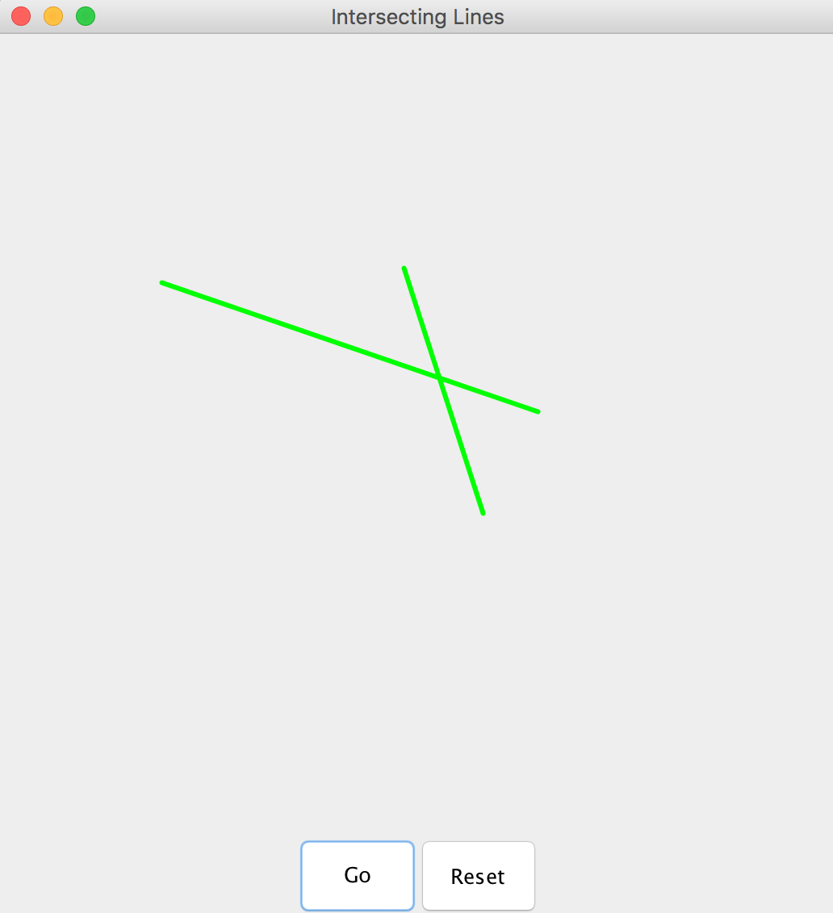
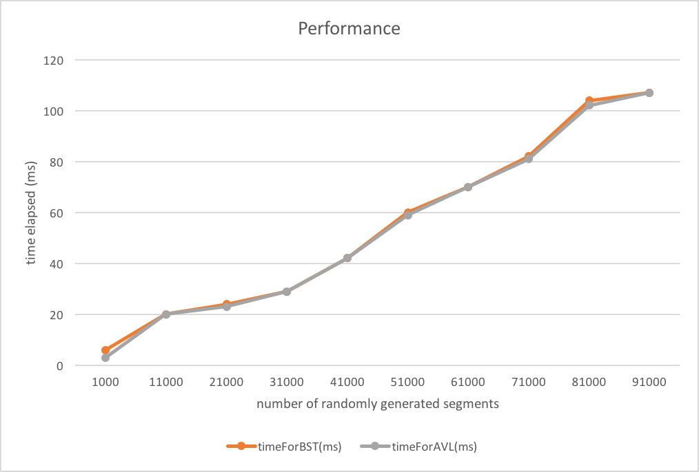

## Segment Intersection




##### Compilation

```
cd src/
javac *
```

##### Run
```
java Driver
```

##### Implementation

Implemented BinarySearchTree and AVLTree.

1. Methods in BinarySearchTree:

(1)insert:

Basically, for the new coming key,
if it's less than the current node, insert it to the left sub-tree of the node,
else insert it to the right sub-tree of the node.
Then we will update every node's above and below attributes by in-order traversal
using updateOrders() method we provide.

(2)search

Basically, for the new coming key,
if it's less than the current node, search it in the left sub-tree of the node,
else search it in the right sub-tree of the node.

(3)delete

Basically, for the to-be-deleted key,
if it's less than the current node, delete it from the left sub-tree of the node,
else delete it from the right sub-tree of the node.
Then we will update every node's above and below attributes by in-order traversal
using updateOrders() method we provide.

2. Methods in of AVLTree:

insert:
The framework is similar with the BinarySearchTree's insert method. But in this case, we need to consider the balance of the tree.
Each time we insert a key, we need to keep the balance of the tree. We will call rotation method as needed.
We provide 4 methods: LLRotation, LRRotation, RLRotation, RRRotation to deal with the 4 kinds of unbalance situation.

search
This is basically the same with BinarySearchTree's search method.

delete
It's similar with the BinarySearchTree's delete method. But we need to care about the balance. If deletion makes the tree
unbalanced, use one of the 4 rotation method to deal with the certain situation.


3. Methods in of Node:

we have key, above and below attributes available. The above and below attributes will be updated
every time when a node is added to the tree.
So the after method returns the above value, the before method returns the below value, the getKey
method returns the key.


We also provide some tests inside of the BinarySearchTree and AVLTree class.


In addition, provide a PerformanceTest class to test the performance. Each test will run 20 times.
The segments are randomly generated and the number of segments is from 1000 to 100000.
From the result chart, we can see that the performance is very close.  It's probably becuase that this algorithm
doesn't have to search the whole space. The algorithm itself has low time complexity. So the difference of these two
trees doesn't show here.



